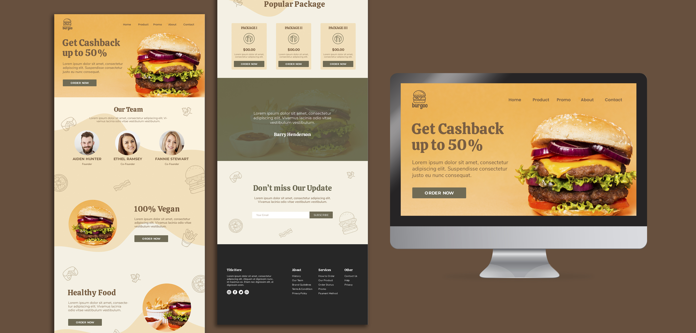

# Hi, I am Danny A. Rodriguez

## About me
I am a Senior Web & Blockchain Developer with over 7 years of experience in building scalable and efficient web applications and decentralized solutions. My passion lies in leveraging cutting-edge technologies to solve complex problems and deliver value to users.

- 🌐 Proficient in JavaScript, TypeScript, React, Node.js, and Solidity
- 🔗 Experienced in blockchain technologies including Ethereum, Hyperledger, and smart contract development
- 🛠️ Strong background in full-stack development with a focus on performance and security
- 💡 Advocate for open-source software and collaboration

## Skills
- **Web Development:**
  - Front End •        
  - Back End •     
  - Database •   
- **Blockchain Development:**
  - Smart Contracts • 
  - Protocols •  
  - Tools •  
- **Software Development:** •      
- **DevOps**  •  
<!--  -->

### Services provided
IT Consulting • Application Development • Cloud Application Development • Database Development • Information Management • Information Security • Web Design • Web Development

### Contact me    

#Telegram username @cryptoraise97

#Crypto trading Site

#Restaurant Site

#Restaurant Site
<!--
**DannyRodriguezFSWD/DannyRodriguezFSWD** is a ✨ _special_ ✨ repository because its `README.md` (this file) appears on your GitHub profile.

Here are some ideas to get you started:

- 🔭 I’m currently working on ...
- 🌱 I’m currently learning ...
- 👯 I’m looking to collaborate on ...
- 🤔 I’m looking for help with ...
- 💬 Ask me about ...
- 📫 How to reach me: ...
- 😄 Pronouns: ...
- ⚡ Fun fact: ...
-->
